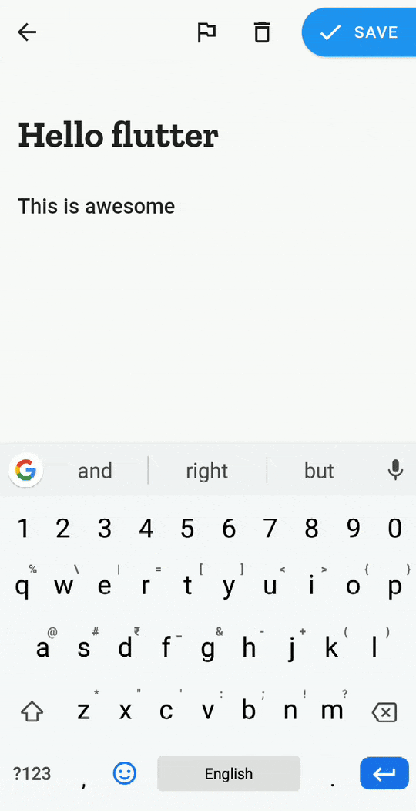
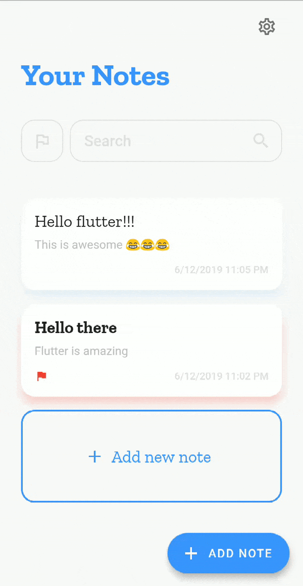

# Draft - Notes app

An elegant notes taking app written in Flutter that uses sqflite for storage.

## Features
1. *Animated UI*: A beautiful, minimalist user interface with subtle animations.
2. *Dark mode*: Light and dark theme variants.
3. *Mark notes as important*: Mark notes as important and filter them.
4. *Search*: Search your notes.
5. *Edit note*: Edit note that you saved previously
6. *Share*: Share note using any app that can share text.

## Dependencies
- outline_material_icons: ^0.1.0
- sqflite: ^1.1.5
- intl: ^0.15.8
- url_launcher: ^5.0.3
- shared_preferences: ^0.5.3+1
- share: ^0.6.1+1

## Run the project
- With Flutter installed, clone project and run `flutter run --release` in that directory, 
or
- Download the built APK from [here](https://github.com/roshanrahman/flutter-notes-app/raw/master/github_assets/draft.apk)

## Screenshots

Feedback is welcome! Contact me for any info.

